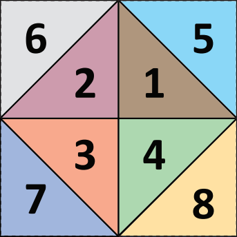

Three.js HTM/TOAST Sphere extensions
======================

A **H**ierarchical **T**riangular **M**esh variant of the standard Three.js SphereGeometry. The geometry features an implementation of the [TOAST](http://www.worldwidetelescope.org/docs/worldwidetelescopeprojectionreference.html) projection technique.

Complete with examples!

## Usage
```javascript
var myHTMSphereGeometry = new THREE.HTMSphereGeometry(radius, subdivisionLevels);
var toastMaterial = new THREE.MeshPhongMaterial({
  map: THREE.ImageUtils.loadTexture('toast.jpg')
});
var myHTMSphere = new THREE.Mesh(
  myHTMSphereGeometry,
  toastMaterial
);
```


